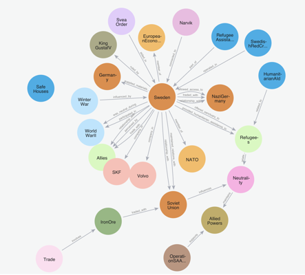

# Agentic Deep Graph Reasoning Implementation

This repository contains a practical implementation of the groundbreaking paper by [Markus J. Buehler](https://orcid.org/0000-0002-4173-9659) titled ["Agentic Deep Graph Reasoning"](https://arxiv.org/abs/2502.13025), which introduces a novel framework for autonomous knowledge graph expansion and refinement.

## 🌟 Key Features

- **Iterative Graph Expansion**: Autonomously grows knowledge graphs through recursive reasoning and structured knowledge extraction
- **Multi-Model Architecture**: Leverages specialized language models for reasoning and entity extraction
- **Neo4j Integration**: Persistent storage and querying of the generated knowledge graph
- **Streaming Output**: Real-time visualization of the reasoning process
- **Flexible Model Configuration**: Supports different LLM providers through configurable API endpoints

## Examples

**Prompt:** "Describe the role and stance of Sweden during World War II"
**Iterations:** 2

[Large version of image](images/SwedenWW2_2_Iterations.png)

## 🔧 Technical Architecture

The system consists of three main components:

1. **Reasoning Engine**: Generates detailed reasoning traces about a given topic
2. **Knowledge Extractor**: Converts unstructured reasoning into graph-structured data
3. **Graph Manager**: Handles Neo4j database operations and graph maintenance

## 🚀 Quick Start

### Prerequisites

- Python 3.8+
- Docker and Docker Compose
- Access to OpenAI API or compatible LLM API endpoints

### Installation

1. Clone the repository:
```bash
git clone https://github.com/yourusername/agentic-deep-graph-reasoning.git
cd agentic-deep-graph-reasoning
```

2. Install dependencies:
```bash
pip install -r requirements.txt
```

3. Start Neo4j:
```bash
docker-compose up -d
```

### Configuration

1. Copy the example environment file:
```bash
cp .env.example .env
```

2. Configure your environment variables in `.env`:

```env
# Neo4j Configuration
NEO4J_URI=bolt://localhost:7687
NEO4J_USER=neo4j
NEO4J_PASSWORD=testtest

# Reasoning Model Configuration
REASONING_MODEL_CONFIG='{"model_name": "your-reasoning-model", "OPENAI_API_KEY": "your-key", "base_url": "your-api-url"}'

# Entity Extraction Model Configuration
ENTITY_EXTRACTION_MODEL_CONFIG='{"model_name": "your-extraction-model", "OPENAI_API_KEY": "your-key", "base_url": "your-api-url"}'
```

#### Model Configuration Options

- For OpenAI models:
  - `base_url`: "https://api.openai.com/v1/"
  - `model_name`: "gpt-4", "gpt-3.5-turbo", etc.

- For local models (e.g., Ollama):
  - `base_url`: "http://localhost:11434/v1/"
  - `model_name`: "llama2", "mistral", etc.

### Reasoning Trace Format

This implementation expects the reasoning model to output its reasoning within XML-style `<think>` tags. This format is particularly suited for models like DeepSeek's distilled R1 series, which are trained to provide structured reasoning traces.

Example expected output:
```xml
<think>
Okay, so I need to figure out the ...
Now, thinking about ...
</think>
```

When using custom models or different LLM providers, ensure they:
1. Always wrap reasoning in `<think>` tags
2. Provide structured, step-by-step reasoning
3. End the reasoning trace with `</think>`

The system uses these tags to properly parse and process the reasoning trace for knowledge extraction. If your model doesn't natively support this format, you may need to modify the system prompt or post-process the output.

### Running the Application

Run the knowledge graph generation with:
```bash
python agentic_deep_graph_research.py "Your initial prompt" <number-of-iterations>
```

Example:
```bash
python agentic_deep_graph_research.py "Describe a way to design impact resistant materials" 3
```

## 📖 Example Prompts

- "Describe a way to design impact resistant materials"
- "Describe the role and stance of Sweden during World War II"
- "Explain how photosynthesis works in plants"

## 🎯 Core Innovation

Unlike traditional knowledge graph systems, this implementation follows the paper's agentic approach where the system:

- Autonomously determines what knowledge to expand
- Maintains contextual awareness across iterations
- Structures knowledge organically through reasoning
- Self-validates and refines existing knowledge

## 📊 Technical Components

- **models.py**: Defines Pydantic models for entities and relationships
- **agentic_deep_graph_research.py**: Core implementation of the agentic reasoning system
- **Docker**: Neo4j containerization for graph storage
- **Environment Configuration**: Flexible model and API setup

## 🔍 Monitoring and Debugging

- Check Neo4j browser interface at `http://localhost:7474`
- View logging output in real-time during execution
- Monitor entity and relationship creation in the console output

## 🤝 Contributing

Contributions are welcome! Please read the contributing guidelines before submitting PRs.

## 📚 Citation

If you use this implementation in your research, please cite the original paper:

```bibtex
@article{deepgraphreasoning2025,
  title={Agentic Deep Graph Reasoning},
  author={[Markus J. Buehler]},
  journal={arXiv preprint arXiv:2502.13025},
  year={2025}
}
